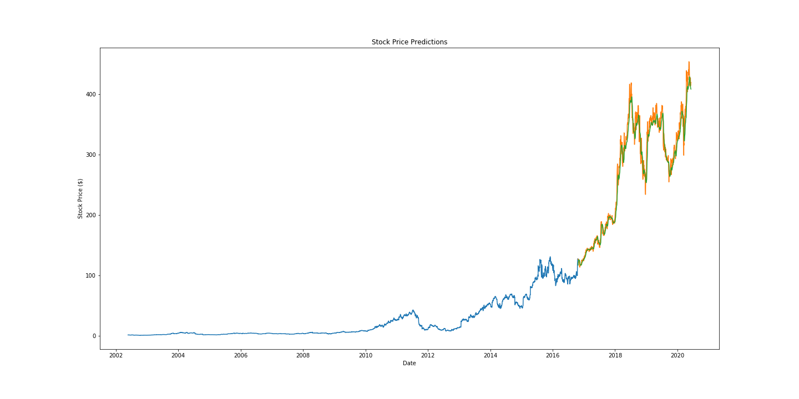

# Stock Prediction Bot
A Python script that produces predictions for recent stock activity for a given stock.
Utilizes an LSTM network to generate predictions by using the stock activity over the past 75 days to generate a stock price prediction for the next day.

## Execution Process
1. Install the required dependencies.
~~~~
pip install requests_html
~~~~~~~~ 
~~~~
pip install yahoo_fin
~~~~~~~~ 

2. Download data for any particular stock, replacing 'stock-ticker-symbol' with the ticker symbol of the required stock - for example, AAPL or NFLX.
~~~~
python retrieve.py -s <stock-ticker-symbol>
~~~~~~~~ 

3. Train the model on the stock's data and have it predict recent stock prices.
~~~~
python train.py
~~~~~~~~ 

## Generated Output Files
* stock_data.csv: A dataset with the retrieved stock price data for the required stock.
* results.png: A graph of the recent stock price predictions.
* stock-predictor.h5: A saved model of the LSTM network.
* scaler.save: A saved model of the Scaler used to process data.

## Sample Prediction Graph
 
